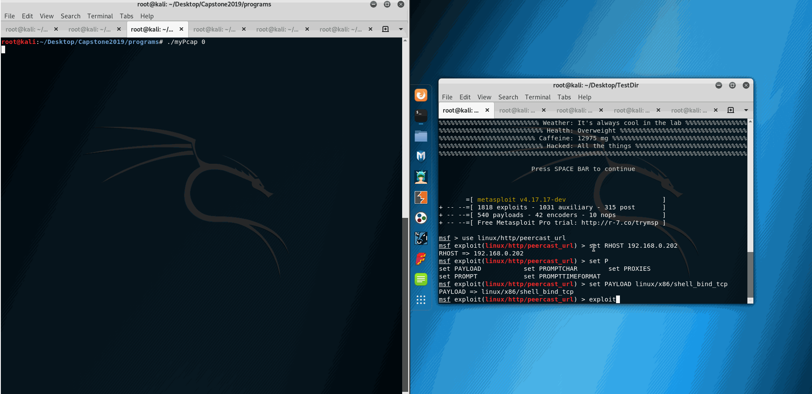

"# Leto_Capstone2019"

- [] Description: The demos folder contains sample gifs of the results of my Capstone project. The project is a packet analysis tool using libpcap which detects 3 common network attacks: ARP Pollution, Buffer Overflow with NOP sleds, and Port Scanning. While the tool is used to help defend against attacks on the Link, Network and Transport layers, it has the capability to be expanded to cover all 7 layers of the OSI model, and to prevent intrusion by many other attacks on those same layers.

- [] ARP Pollution
- In this example you can see that a forged ARP reply is sent out from the attacker to the host VM running the analysis tool. Shortly after being sent out, the tool detects the ARP reply contains a mismatched MAC address that does not belong to the IP it claims to be coming from and the attacker is blocked.
  - [ ] GIF Walkthrough: 
  	
    
- [] Port Scanning
- In this example we run nmap with the "-F" option to scan 100 common ports. On the defender side, we use netcat to open 6 ports from the 100 range of ports and after scanning 20 different port, the attacker is blocked. On the attackers side you may notice that only 2 of the six ports opened were detected before it was blocked and nmap incorrectly guesses the fingerprint of the defender's system.
  - [ ] GIF Walkthrough: 
  	
    
- [] Buffer Overflow
- In this final example we show an overflow attempt on a vulnerable remote peercast program. The metasploit "peercast_url.rb" file has been modified to simulate a NOP sled as well. We can see here that shortly after the exploit is run, the tool blocks the attacker the second a sled has been identified.
  - [ ] GIF Walkthrough: 
  	
